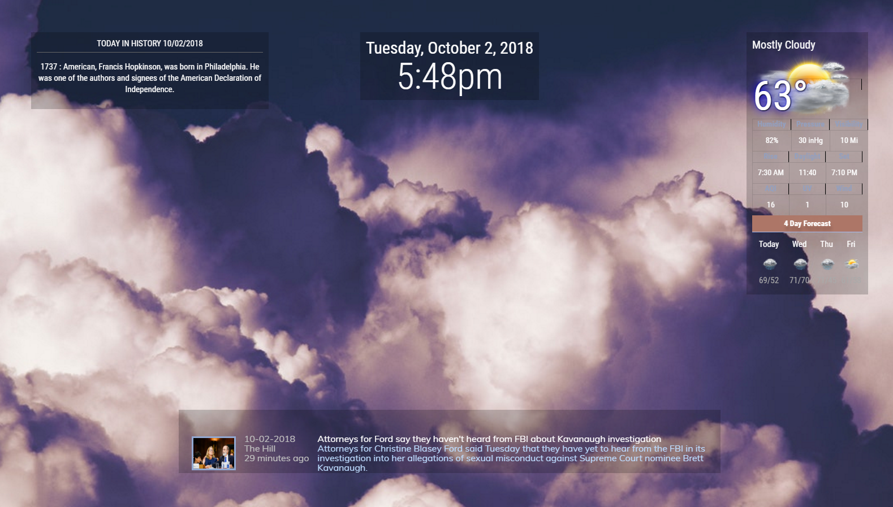
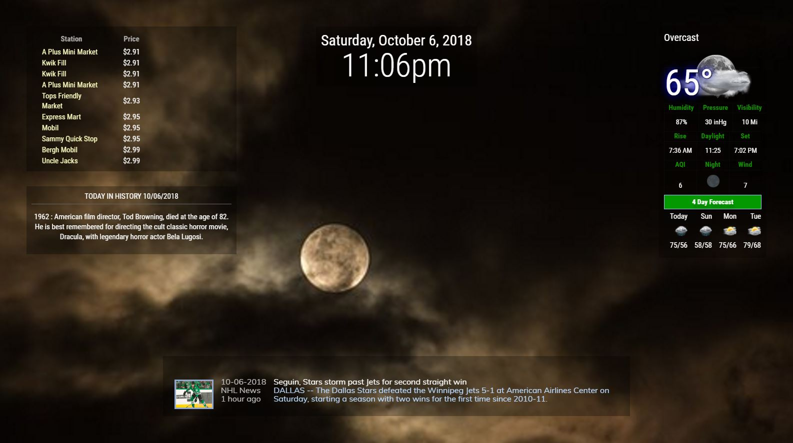

# MMM-WeatherBackground
MagicMirror Module - for Weather image background. This is a plugin of other weather modules.

## Screenshot
  Day


  Night 



## Installation
```shell
cd ~/MagicMirror/modules
git clone https://github.com/cowboysdude/MMM-WeatherBackground
```

## Configuration
### Simple
```javascript
{
            disabled: false,
            module: "MMM-WeatherBackground"  
}, 
``` 
That's pretty much the entire config entry that can be put anywhere in your config.js.
## BE AWARE
If you don't get a background let me know what the weather in the module says, perhaps there's no image for it and needs to be updated :)
